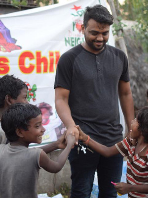

<section id="service" class="section-padding">
      

        

          

            <h2 class="service-title pad-bt15">What Do We Do?</h2>
            
Our children's ministry provides pastoral care, basic human needs (food, shelter), and education to children in need. The problems that children face in India are very systematic and it's so easy for organizations to become distracted. We stay focused and effective by committing to living out our core values of being:

            

          

          

            

              <h3>Child Focused</h3>
              
Studies have shown that India is home to an estimated 20 million orphans. We believe that by "caring for the one in front of us", we are changing the direction of the entire country by raising up a generation that can make a difference.

            

          

          

            

              <h3>Action Driven</h3>
              
While we are a forward-focused ministry with goals of solving problems at their root, we are commited to meeting the immediate needs of children. We refuse to become so focused on the larger problem that we become blind to the individual.

            

          

          

            

              <h3>Recklessly Loving</h3>
              
Our team carries the love of Father God and brings it to every child they meet. We know that every interaction is an opportunity for each child to encounter the fullness of our God. We are committed to representing the LOVE of God by becoming love.

            

          

          

            

              <h3>Excuse Free</h3>
              
We simply refuse to have excuses for not being able to do what we know that we're called to do. God said to love and provide and our team doesn't stop until they've done exactly that.

            

          

        

      

    </section>

    <section id="blog" class="section-padding wow fadeInUp">
      

        

          

            <h2 class="service-title pad-bt15">How do we do it?</h2>
            
We have several feeding centers spread through out the region of Ongole, India. Collectively, we serve 500-600 children every day by providing food, teaching, and one on one time with each child. 
            These centers provide the only help these children receive each day. These children are orphans. They are hungry. Some are disabled. Some are homeless. Some are considered "untouchables".

            

          

          

            <h2 class="service-title pad-bt15">We need your help!</h2>
            
These feeding centers are run entirely through the donations of our sponsors. <a href="./sponsor.html">Please consider becoming a sponsor today with a one-time or monthly gift!</a>

            

          

        

      

    </section>

    <section id="service" class="section-padding wow fadeInUp">
      

        

          

            <h2 class="service-title pad-bt15">Who We Are</h2>
            
We are a team of individuals, connected through divine appointments, that have committed their lives to spreading the Kingdom of God throughout all the earth. Our focus through this ministry is seeing His Kingdom increase in India in such a way that it abolishes hunger, poverty, and sickness.

            

          

          

            

              
            

            

              <h4 class="staff-name">Josh and Olivia Arnold</h4>
              <h5>Overseers</h5>
              
Josh and Olivia have a heart to see this world be undone by a revelation of God's love: both in word and in deed. Their hearts burn to see revival not only ignited throughout the earth but sustained through devotion and love to Jesus. They currently live in Austin, TX and attend True Life in Round Rock.

            

          

           
          

            

              
            

            

              <h4 class="staff-name">Yedidya Samuel Kodavatikanti</h4>
              <h5>Founder</h5>
              
Sam attended Bible college at Texas Bible Institute and began to burn to see revival take root in his home town. Through divine connections, Sam became friends with Josh and Olivia and they began to partner together to bring resources to the work that Sam was already doing by himself.

            

          

        

      

    </section>

